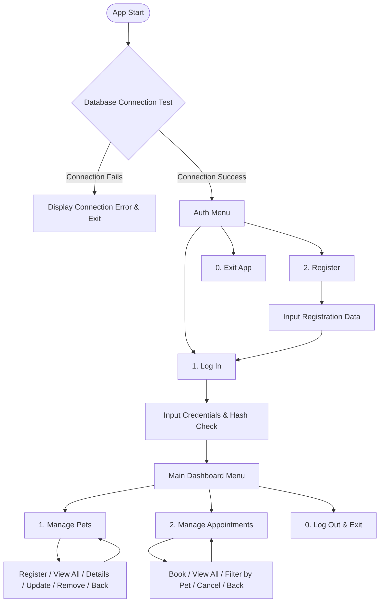

# PetMoCo: Smart Pet Booking System a Console-Based Java Booking Application

PetMoCo is a professional console-based Java application designed for managing pet care and service bookings. It supports scheduling for Grooming, Sitting, and Walking services, featuring secure password-hashed user authentication and persistent relational database storage via MySQL.

---

## Core Features

| Module | Description |
| :--- | :--- |
| **Authentication** | Secure user registration and login with SHA-256 password hashing. |
| **Pet Management** | Full CRUD operations (Register, View, Update, and Remove) for pet profiles. |
| **Appointment Scheduling** | Book, view, filter by pet, and cancel appointments for various service types. |
| **Service Support** | Pre-configured service types: Grooming, Sitting, and Walking. |
| **Database Persistence** | Permanent storage using MySQL database via Java Database Connectivity (JDBC). |
| **Robust Validation** | Type-safe input parsing that enforces correct formats for dates, times, and numerical inputs. |

---

## Technologies Used

*   **Java 17+** - Core language execution and application runtime environment.
*   **MySQL & JDBC** - Relational database engine and JDBC API for secure database queries.
*   **dotenv-java** - Lightweight library to load environmental configurations from a `.env` file.
*   **SHA-256 Encryption** - Built-in security algorithm (`java.security`) for storing hashed passwords.
*   **Scanner Input API** - Text-based user interaction and menu navigation framework.

---

## System Architecture & File Structure

The project is structured according to clean code principles, separating database connections, data access objects, and UI menus.

```text
PetMoCo/
├── src/
│   ├── Main.java                   - Application entry point
│   ├── models/                     - Enterprise domain models
│   │   ├── User.java               - User base class
│   │   ├── Pet.java                - Pet entity model
│   │   └── Appointment.java        - Appointment details model
│   ├── services/                   - Service and business logic layers
│   │   ├── UserService.java        - Account creation and authentication logic
│   │   ├── PetService.java         - Pet profiles and validation rules
│   │   └── AppointmentService.java - Appointment flow validations
│   ├── dao/                        - Data Access Objects (SQL queries)
│   │   ├── UserDAO.java            - Database operations for users and owners
│   │   ├── PetDAO.java             - Database operations for pets
│   │   └── AppointmentDAO.java     - Database operations for appointments
│   ├── utils/                      - Core utilities and helpers
│   │   ├── DatabaseConfig.java     - Connection manager singleton
│   │   ├── ConsoleHelper.java      - Screen rendering and formatting UI helpers
│   │   └── InputValidator.java     - Type-safe, validated keyboard input reader
│   ├── menus/                      - User Interface menus
│   │   ├── AuthMenu.java           - Registration and login UI workflows
│   │   ├── MainMenu.java           - Primary dashboard menu router
│   │   ├── PetMenu.java            - Pet management UI console
│   │   └── AppointmentMenu.java    - Appointment booking UI console
│   └── data/                       - SQL schemas and setup files
│       └── script.sql              - Database initialization script
├── lib/                            - External dependencies (JAR files)
│   ├── mysql-connector-j-9.7.0.jar
│   └── dotenv-java-3.0.0.jar
├── .env                            - Local configuration parameters (gitignored)
├── .gitignore                      - Standard Git ignores
└── README.md                       - Documentation (this file)
```

---

## Technical Flow and Navigation

The interface provides an interactive, structured flow that drives users from verification to service selection.



---

## Setup and Execution Guide

Follow these steps to configure, build, and run the project locally.

### 1. Prerequisites

Before starting, ensure you have:
*   Java Development Kit (JDK) 17 or higher installed and added to your path.
*   A running instance of MySQL server.
*   The required libraries present in the `lib` directory.

### 2. Database Initialization

Run the provided setup script on your SQL server to create the database schemas and initialize the user accounts:

```sql
-- Connect to your MySQL shell or Workbench and execute:
source src/data/script.sql
```

> [!NOTE]
> The database initialization script automatically seeds a default administrator account.
> *   **Username**: admin
> *   **Password**: admin123

### 3. Environment Configuration

Create a file named `.env` in the root directory of the project and populate it with your local database connection details:

```ini
DB_URL=jdbc:mysql://localhost:3306/petmoco_db
DB_USER=root
DB_PASSWORD=your_mysql_password_here
```

### 4. Compilation

From the root directory of the project, compile the Java source files.

**On Windows (PowerShell):**
```powershell
javac -cp "lib/*" -d out (Get-ChildItem src -Recurse -Filter "*.java" | Select-Object -ExpandProperty FullName)
```

**On Linux / macOS:**
```bash
javac -cp "lib/*" -d out $(find src -name "*.java")
```

### 5. Running the Application

Execute the compiled class files from the output directory.

**On Windows (PowerShell):**
```powershell
java -cp "out;lib/*" main.Main
```

**On Linux / macOS:**
```bash
java -cp "out:lib/*" main.Main
```

### 6. VS Code Configuration (Optional)

If using VS Code:
1. Install the **Extension Pack for Java**.
2. Open the project root folder.
3. Locate `src/Main.java` and click **Run** above the `main` method (the `.vscode/settings.json` is already configured to reference local dependencies).

---

## Important System Behaviors

*   **Security Standards**: Passwords are securely hashed using SHA-256 before insertion. The system does not store or transmit cleartext passwords.
*   **Cascade Deletions**: Deleting a pet profile automatically cascade-deletes all associated appointments from the database.
*   **Soft Cancellation**: Cancelling an appointment updates its status to `CANCELLED` within the database. It is not physically deleted, preserving historical records.
*   **Configuration Isolation**: The `.env` file contains sensitive local credentials and should never be committed to git repositories.
*   **Input Formatting Rules**:
    *   **Dates**: Must adhere to the `YYYY-MM-DD` format (e.g., 2026-06-29).
    *   **Times**: Must adhere to the 24-hour `HH:MM` format (e.g., 14:30).
